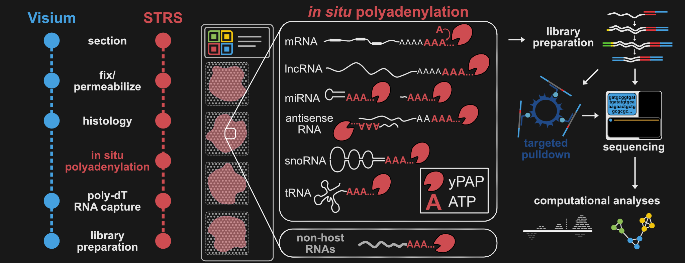

# **Spatial Total RNA-Sequencing:** ***STRS***
Suite of molecular and computational workflows for Spatial Total RNA-Sequencing (STRS)

### See our preprint [here](https://www.biorxiv.org/content/10.1101/2022.04.20.488964v1)!

This repository has all the protocols, pipelines, and scripts you will need to run and analyze STRS on any sample!

### Subdirectory descriptions:
- `manuscripts`: .pdf files of the preprint and subsequent manuscript (hopefully!)
- `protocols`: Microsoft word and .pdf documents of the protocols used here
- `pipelines`: Snakemake workflows used in our study. These include alignment pipelines for STRS data (kallisto, STARsolo, & miRge3.0), small RNAseq data (STAR & miRge3.0), SmartSeqTotal (kallisto), and VASAdrop (kallisto)
- `scripts`: All the other code we used! Mostly contains R scripts and utility functions used in our spatial analyses.
- `references`: info & scripts on reference genomes & annotations used in this study
- `resources`: assorted metadata, gene lists, and other information that we used to analyze our data
*see README files in each subdirectory for more details*

### Data generated for this paper:
- STRS datasets: [GSE200481](https://www.ncbi.nlm.nih.gov/geo/query/acc.cgi?acc=GSE200481)
- SkM/heart small RNAseq data: [GSE200480](https://www.ncbi.nlm.nih.gov/geo/query/acc.cgi?acc=GSE200480)
- single-nucleus total RNAseq data (C2C12 cell line): [GSE209780](https://www.ncbi.nlm.nih.gov/geo/query/acc.cgi?acc=GSE209780)

### Additional data analyzed:
- Small RNA Atlas data (Isakova et al, *PNAS*, 2020): [GSE119661](https://www.ncbi.nlm.nih.gov/geo/query/acc.cgi?acc=GSE119661)
- SmartSeqTotal data (Isakova et al, *PNAS*, 2021): [GSE151334](https://www.ncbi.nlm.nih.gov/geo/query/acc.cgi?acc=GSE151334)
- VASAdrop data (Salmen et al, *Nature Biotechnology*, 2022): [GSE176588](https://www.ncbi.nlm.nih.gov/geo/query/acc.cgi?acc=GSE176588)

## Contact:
- Iwijn De Vlaminck (id93@cornell.edu)
- Benjamin D. Cosgrove (bdc68@cornell.edu)
- David W. McKellar (dwm269@cornell.edu)
