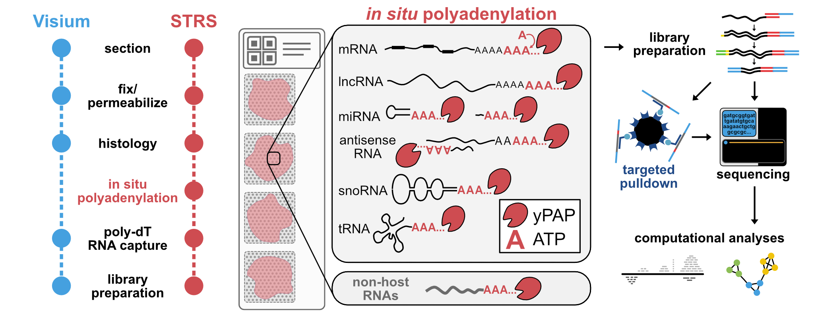

# **Spatial Total RNA-Sequencing:** ***STRS***
Suite of molecular and computational workflows for Spatial Total RNA-Sequencing (STRS)

### See our preprint [here]()!

This repository has all the protocols, pipelines, and scripts you will need to run and analyze STRS on any sample!

### Subdirectory descriptions:
- `manuscripts`: .pdf files of the preprint and subsequent manuscript (hopefully!)
- `protocols`: Microsoft word and .pdf documents of the protocols used here
- `pipelines`: Snakemake workflows used in our study. These include alignment pipelines for STRS data (kallisto & STARsolo) & small RNAseq data (STAR & miRge3.0)
- `scripts`: All the other code we used! Mostly contains R scripts and utility functions used in our spatial analyses.
- `references`: info & scripts on reference genomes & annotations used in this study
- `resources`: assorted metadata, gene lists, and other information that we used to analyze our data

## Contact:
- Iwijn De Vlaminck (id93@cornell.edu)
- David W. McKellar (dwm269@cornell.edu)
