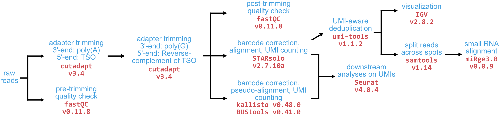

# **Pipelines**

Snakemake workflows used to align, quantify, and quality check sequencing libraries from STRS data. Brief descriptions below, see each pipeline for detailed descriptions on input/output files and package dependencies.

## `10x_kallisto`
Read preprocessing, QC, and pseudoalignment/quantification with [kallisto and bustools](https://github.com/pachterlab/kallistobustools) for **10x Genomics (Visium or STRS) data**

## `10x_STAR`
Read preprocessing, QC, and alignment/quantification with [STARsolo](https://github.com/alexdobin/STAR)  for **10x Genomics (Visium or STRS) data**

## `sp_mirge3`
After alignment (w/ STAR), this pipeline splits the barcoded and UMI-deduplicated reads across spots/cells, then runs [miRge3.0]() on each spot individually to align/quantify small RNAs.

## `bulk_smRNAseq`
Pipeline for standard small RNAseq data sets. Aligns with `STAR` as well as `miRge3`

## `SST_kallisto`
Read preprocessing, QC, and pseudoalignment/quantification with [kallisto and bustools](https://github.com/pachterlab/kallistobustools) for **Smart-Seq-Total** data
- Author's github: [link](https://github.com/aisakova/smart-seq-total/)
- Manuscript: [link](https://www.pnas.org/doi/10.1073/pnas.2113568118)

## `VASAseq_kallisto`
Read preprocessing, QC, and pseudoalignment/quantification with [kallisto and bustools](https://github.com/pachterlab/kallistobustools) for **VASAseq** data
- Author's github: [link](https://github.com/hemberg-lab/VASAseq_2022)
- Manuscript: [link](https://www.nature.com/articles/s41587-022-01361-8)
